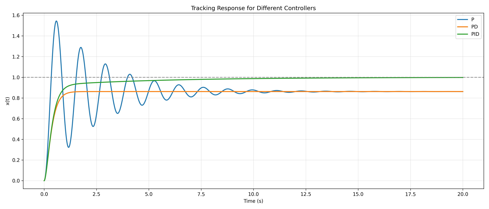
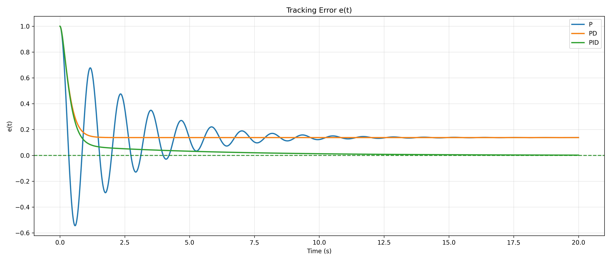
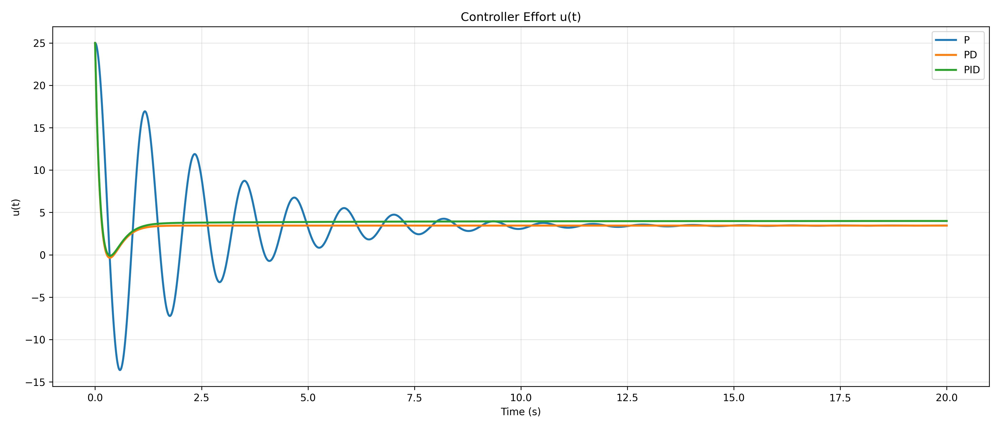
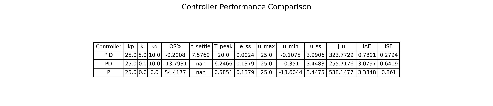

# PID Tracking Control - Mass-Spring-Damper (Python)

This project simulates a 1-DOF mass-spring-damper system and compares **P**, **PD**, and **PID** controllers for tracking a constant position reference.

## System Model
## System Model

The system is modeled as a 1-DOF mass–spring–damper:

`m x''(t) + c x'(t) + k x(t) = u(t)`

Where:
- m: mass
- c: damping coefficient
- k: spring stiffness
- x(t): displacement
- u(t): control input

The controllers are applied in a tracking form with error 

## Error Definition

e(t) = x_d - x(t)
de/dt = -x'(t)

## Controllers

- P:   u(t) = Kp e(t)
- PD:  u(t) = Kp e(t) + Kd (de/dt)
- PID: u(t) = Kp e(t) + Kd (de/dt) + Ki ∫₀ᵗ e(τ) dτ

## Features
- Numerical integration using 
`scipy.integrate.solve_ivp`
- Performance metrics:
  - Overshoot (%)
  - Settling time (2% band)
  - Peak time
  - Steady-state error
  - IAE / ISE
  - Control effort statistics and energy (`J_u`)
- Generates plots:
  - Tracking response \(x(t)\)
  - Error \(e(t)\)
  - Control effort \(u(t)\)
- Saves results to CSV and JPG (plots + metrics table)


## Project Structure
```text
PIDVer2.0/ 
  config.py
  main.py
  functions/ 
    __init.py
    dynamics.py
    metrics.py 
    plotting.py 
  Results/
    results.csv 
    tracking_response.jpg 
    error_plot.jpg 
    control_effort.jpg 
    metrics_table.jpg
```

## How to Run
```bash
pip install numpy scipy matplotlib pandas
python main.py
```
## Results Preview

### Tracking Response


### Error


### Control Effort


### Metrics Table

